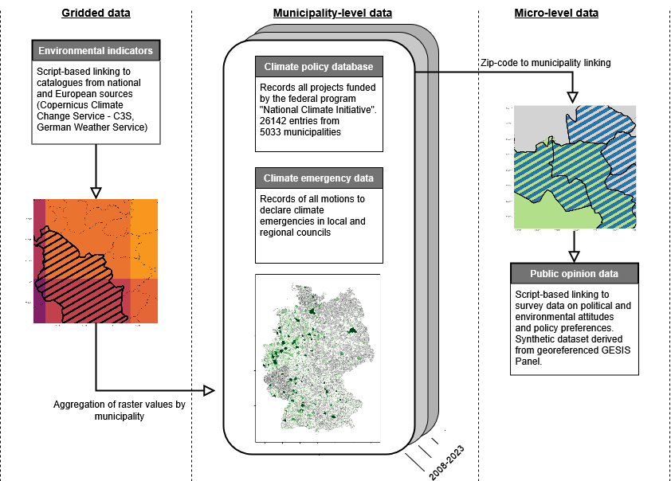

# LOCC-GER: A Georeferenced Local Climate Policy Database for Germany

**Preliminary version 1.0 (2026)**
For first review stage.

LOCC-GER provides georeferenced data on local climate policy in Germany. The repository combines local climate policy measures, climate emergency motions, synthetic public opinion data, and scripts for linking policy data to survey and Earth observation data. For a full documentation, please consult DOCUMENTATION.docx.

---

  

---

## Datasets

### Local climate policy data for Germany

**File:** `./data/local_policy/NKI_full_list_21022024.xlsx`

This dataset contains **26,142 climate policy measures** from **5,033 municipalities** between **2008 and 2023**. It is based on projects funded through the German federal funding scheme **National Climate Initiative** (NKI).

#### Variables

| Variable                           | Description                           |
| ---------------------------------- | ------------------------------------- |
| `FKZ`                              | Project ID                            |
| `Ressort`                          | Responsible ministry                  |
| `Referat`                          | Unit                                  |
| `PT`                               | Cooperating actor of the funding body |
| `Arb.-Einh.`                       | Policy field                          |
| `Zuwendungsempfänger`              | Funding recipient                     |
| `Gemeindekennziffer`               | Municipality code                     |
| `Stadt/Gemeinde`                   | Municipality name                     |
| `Ort`                              | Project location                      |
| `Bundesland`                       | Federal state                         |
| `Staat`                            | Country                               |
| `Ausführende Stelle`               | Implementing entity                   |
| `Thema`                            | Policy field                          |
| `Leistungsplansystematik`          | Policy field code                     |
| `Klartext Leistungsplansystematik` | Description of policy field code      |
| `Laufzeit von`                     | Start date                            |
| `Laufzeit bis`                     | End date                              |
| `Fördersumme in EUR`               | Funding sum in EUR                    |
| `Förderprofil`                     | Overarching topic                     |
| `Verbundprojekt`                   | Collaborative municipal project       |
| `Förderart`                        | Type of funding                       |

---

### Climate emergency motions in local councils

**File:** `./data/climate_emergency/climate_emergency.xlsx`

This dataset records climate emergency motions submitted to German local councils. Motions were identified through desk research conducted from June to August 2024 and cross-checked against activist sources, observer records, and municipal press releases.

The dataset includes whether a motion was submitted, whether it was approved, and the date of formal consideration.

#### Variables

| Variable            | Description                              |
| ------------------- | ---------------------------------------- |
| `ags`               | Municipality code                        |
| `municipality_name` | Municipality name                        |
| `ce_jurisdiction`   | Jurisdiction receiving the motion        |
| `ce_level`          | Administrative level of the jurisdiction |
| `date`              | Date of formal consideration             |
| `submission`        | Whether a motion was submitted           |
| `approved`          | Whether the motion was approved          |
| `notes`             | Additional coder notes                   |

---

### Synthetic public opinion data

**Files:**
`./data/gesis_panel/gp_synth.rds`
`./data/gesis_panel/gp_synth.csv`

**Creation script:**
`./scripts/create_gp_synth.R`

This dataset contains synthetic spatial point data derived from the GESIS Panel using the R package `geosynth`. Each observation represents an INSPIRE-compliant 1 km² grid centroid.

The data are fully synthetic and do **not** contain observed respondent locations. INSPIRE grid identifiers and AGS codes refer to synthetic spatial reference units and must not be interpreted as residential information. No individual-level survey attributes are included.

The dataset is provided in two equivalent formats:

1. `.rds`: R spatial object format, stored as an `sf` object
2. `.csv`: Tabular format with explicit `x` and `y` coordinates

#### Variables and formats

| Variable    | Type             | RDS format            | CSV format | Description                       |
| ----------- | ---------------- | --------------------- | ---------- | --------------------------------- |
| `id`        | integer          | attribute column      | column     | Sequential observation ID         |
| `date`      | character / Date | attribute column      | column     | Constant temporal reference       |
| `ags`       | character        | attribute column      | column     | Official German municipality code |
| `inspid1km` | character        | attribute column      | column     | INSPIRE 1 km² grid cell ID        |
| `geometry`  | POINT geometry   | `sf` geometry column  | —          | Synthetic centroid geometry       |
| `x`         | numeric          | derived from geometry | column     | Easting coordinate                |
| `y`         | numeric          | derived from geometry | column     | Northing coordinate               |

#### Data provenance

| Property                    | Value                                             |
| --------------------------- | ------------------------------------------------- |
| Coordinate reference system | ETRS89 / LAEA Europe                              |
| EPSG code                   | 3035                                              |
| Unit                        | meters                                            |
| Spatial reference           | INSPIRE 1 km² grid centroids with AGS identifiers |
| Geometry derivation         | Synthetic reconstruction via `geosynth`           |
| Temporal structure          | Static; one date applied to all observations      |
| Interpretation              | Fully synthetic; no direct respondent geolocation |

---

## Scripts

### Public opinion data linking

**Main scripts:**
`./scripts/create_gp_synth.R`
`./scripts/gesis_panel_linking.R`
`./scripts/geosynth/create_sample_frame.R`
`./scripts/geosynth/draw_sample.R`
`./scripts/geosynth/shuffle_min_distance.R`
`./scripts/gxc_link_dwd/gxc_link_dwd.R`
`./scripts/gxc_link_dwd/link_dwd_modules.R`

These scripts support linking LOCC-GER to georeferenced survey programs such as the German Longitudinal Election Study Panel and the GESIS Panel. Because original georeferenced survey data are sensitive and only accessible in secure GESIS environments, this repository provides synthetic spatial data for testing and prototyping.

The synthetic data workflow mirrors the spatial structure of the original data while protecting respondent confidentiality. It allows users to test linking routines without accessing restricted coordinates.

#### Synthetic data workflow

1. **Construct sample frame**
   `geosynth::create_sample_frame()` creates eligible municipality-level sampling frames using AGS identifiers, population thresholds, and RegioStaR classifications.

2. **Draw population-weighted sample**
   `geosynth::draw_sample()` samples INSPIRE 1 km² grid centroids from eligible municipalities, weighted by population density.

3. **Apply minimum-distance shuffling**
   `geosynth::shuffle_min_distance()` can be used inside secure environments to ensure synthetic points are at least a predefined distance from original coordinates.

The workflow was implemented using the R package `geosynth`, developed for this project.

---

### Earth observation data linking

**Scripts:**
`./scripts/EO_linking/EO_linking.R`
`./scripts/EO_linking/p_validate_DWD.py`
`./scripts/EO_linking/p00_download_stationdata_dwd.py`
`./scripts/EO_linking/p01_impute_stationdata.py`
`./scripts/EO_linking/p02_aggregate_invdist_stationdata.py`

These scripts support the linkage of LOCC-GER to atmospheric and climate data. Integrated sources include the German Weather Service (DWD), Copernicus Climate Change Service (C3S), and Copernicus Atmosphere Monitoring Service (CAMS).

The repository includes a sample workflow for monthly weather indicators such as temperature, precipitation, and wind based on DWD data. The scripts are designed to support flexible choices of indicators, spatial coverage, temporal coverage, and resolution.

---

## Notes

* Synthetic public opinion data are for methodological development and workflow testing only.
* Synthetic coordinates do not represent observed respondent locations.
* All working-directory references are relative to the repository root.
